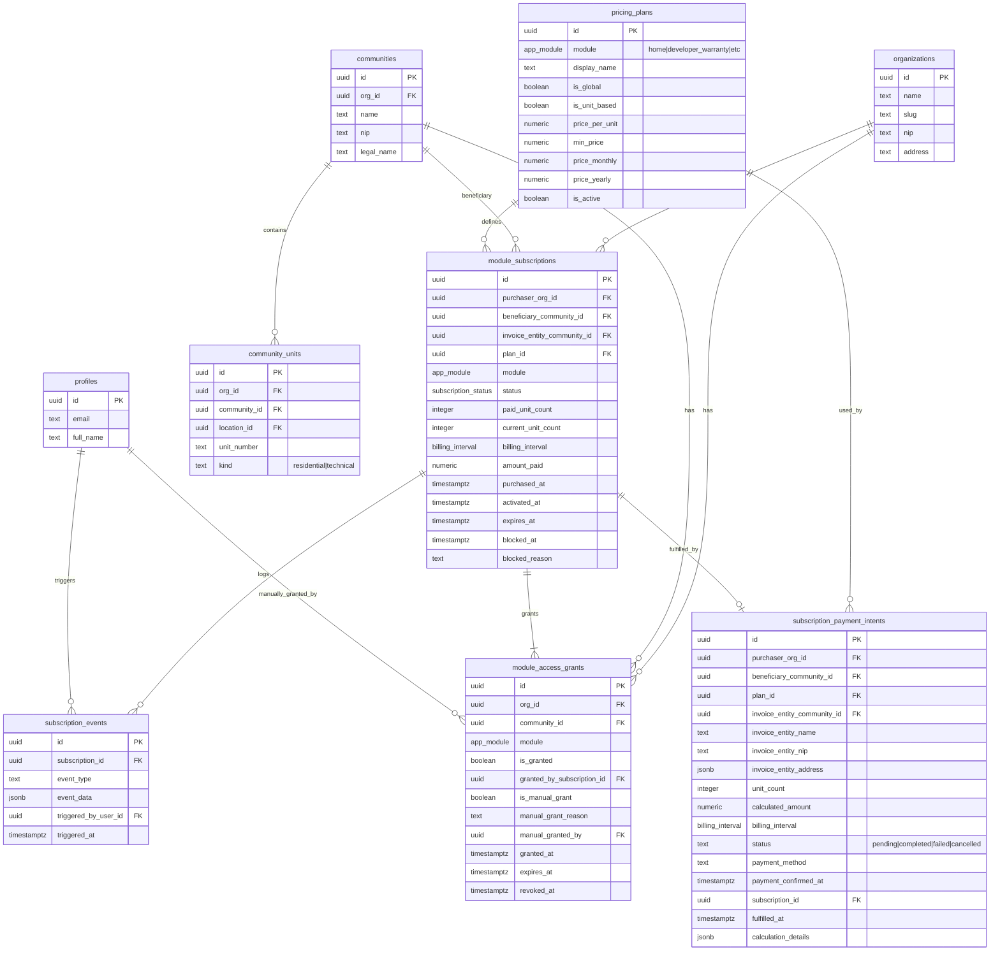
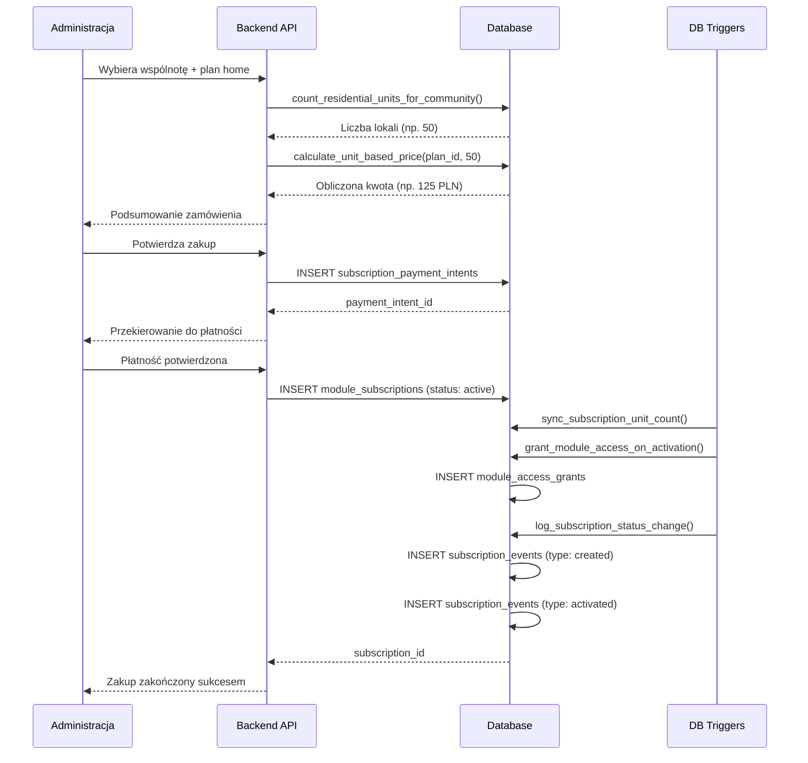
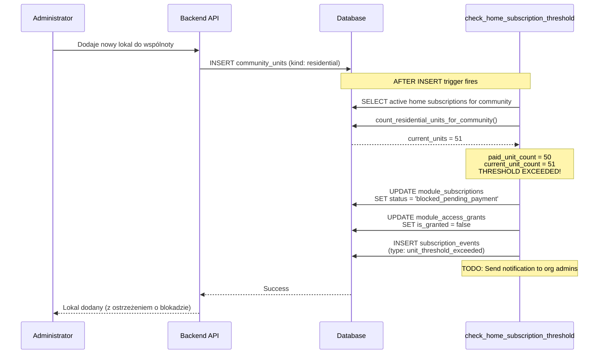
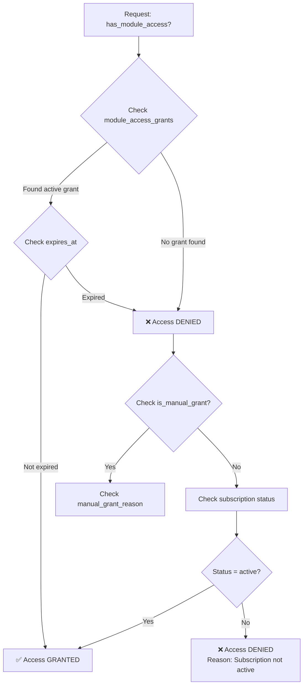
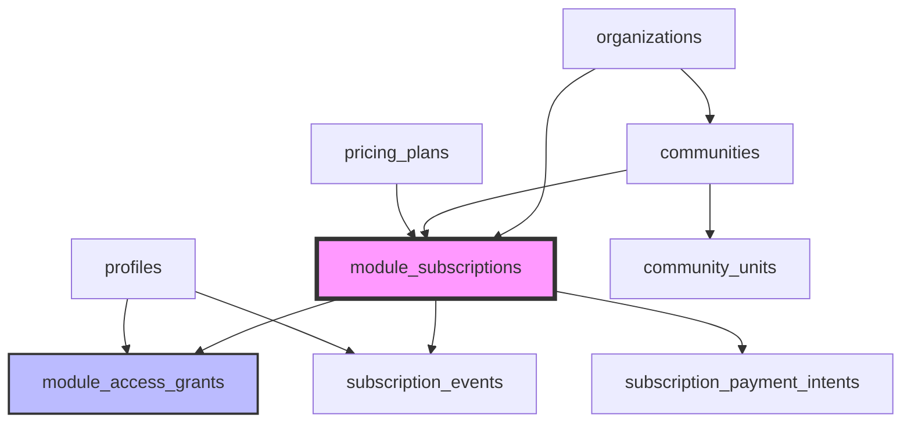
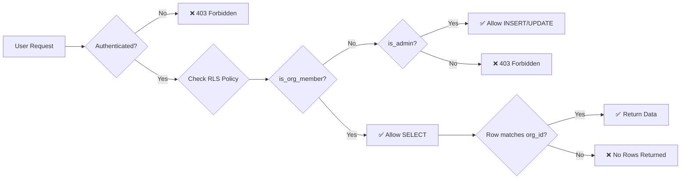
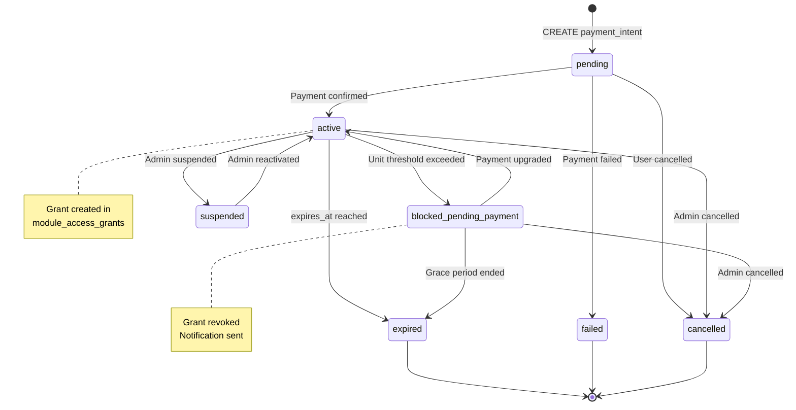
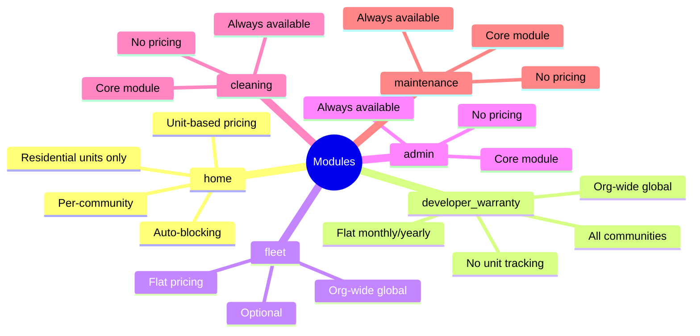
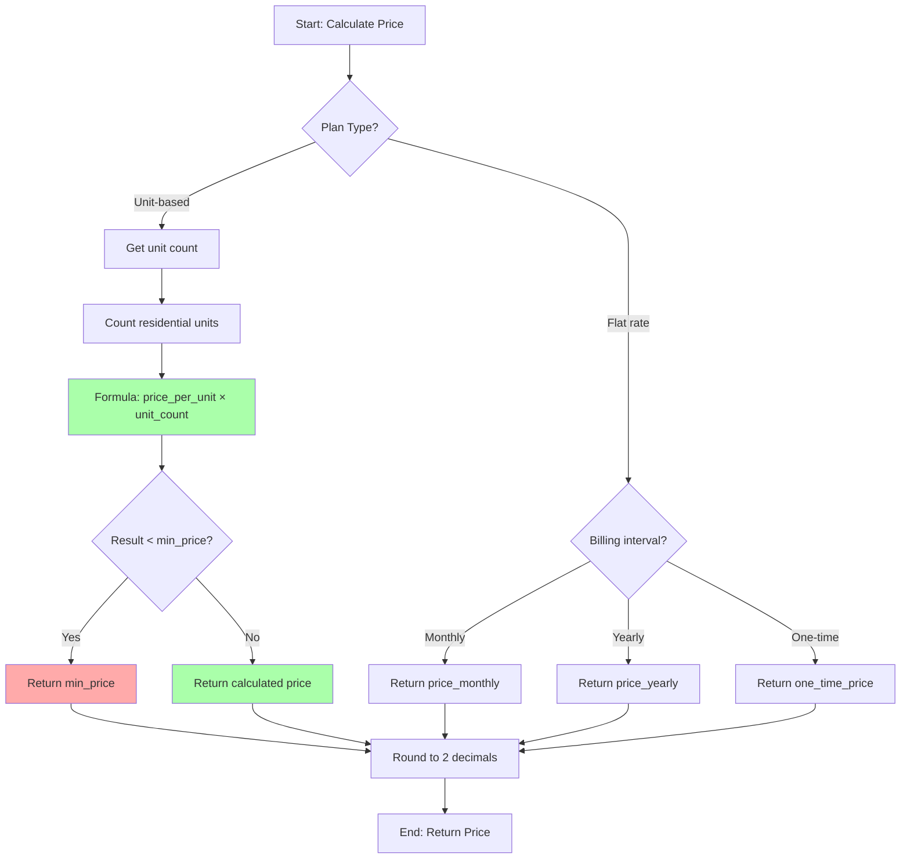
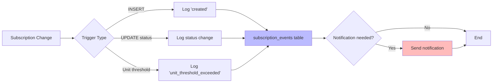

# DOMIO Monetization - Entity Relationship Diagram

## 📊 Database Schema Visualization

### Entity Relationship Diagram (ERD)

## 🔄 Data Flow Diagrams

### Purchase Flow (Home Module)

### Auto-blocking Flow (Unit Threshold Exceeded)

### Access Check Flow

## 🏗️ Table Dependencies

## 🔐 Security & RLS Flow

## 📈 State Machine: Subscription Status

## 🧩 Module Types & Scopes

## 💰 Pricing Calculation Logic

## 🔔 Event Logging Flow

---

## 📝 Diagram Legend

| Symbol | Meaning |
|--------|---------|
| PK | Primary Key |
| FK | Foreign Key |
| ⚡ | Trigger |
| 🔒 | RLS Protected |
| 📊 | Indexed |
| 🔄 | Auto-updated |

---

**Generated:** 2026-10-06  
**Version:** 1.0  
**Tool:** Mermaid Diagrams
